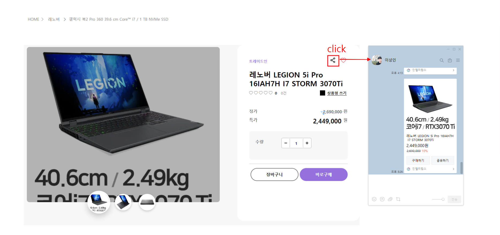
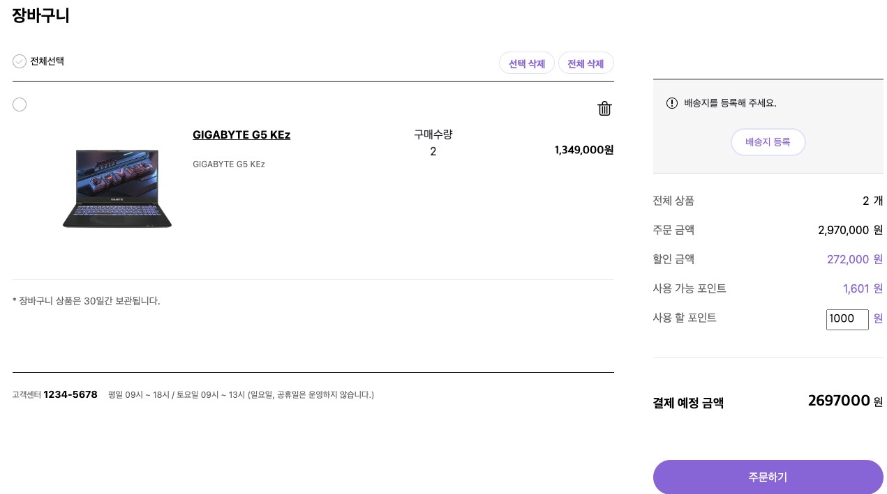
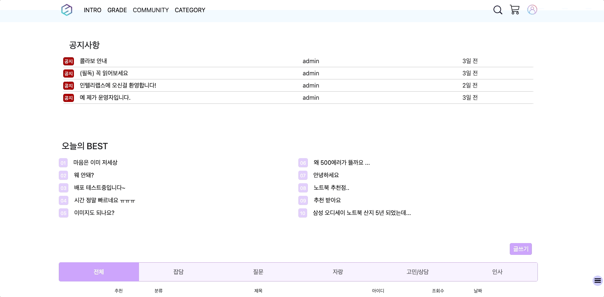
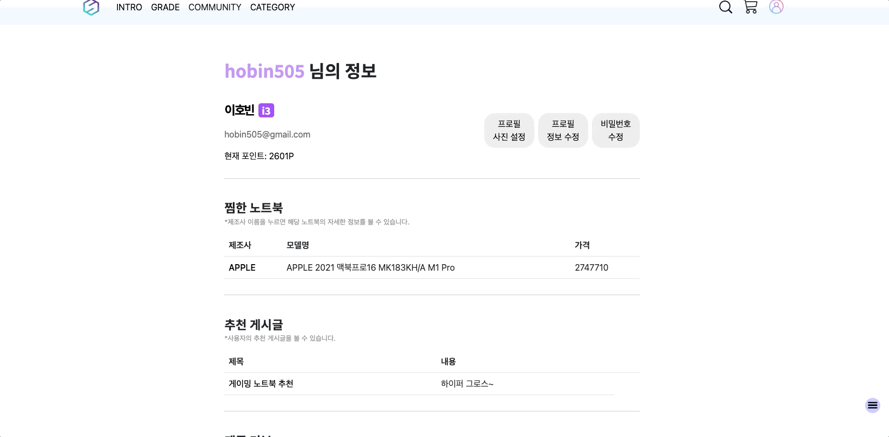

# 인텔리랩스

## 서비스명 : 인텔리랩스 (Intellilabs)

- 노트북 판매 및 노트북 관련 커뮤니티 운영

### ⭐️ 서비스 기획의도

- 노트북을 필요로 하는 사람들이 다양한 조건 필터를 통해 편하게 비교해볼 수 있도록 기획
- 커뮤니티를 통해 노트북에 대한 정보를 공유할 수 있도록 기획

## 💻 서비스 주요기능

- 카카오톡 공유하기

- 장바구니

- 커뮤니티

- 상품 디테일 페이지

.gif)

- 상품 목록페이지

.gif)

- 회원등급 페이지

.gif)

- 프로필 페이지

### 페이지마다 주요 기능

- MAIN
  - 네이게이션바
  - 캐러셀
  - 카테고리
  - 제조사 별 태그
  - 베스트 랭킹
  - 푸터
- INTRO
  - 팀 규칙
  - 팀원 소개
  - 데일리 스크럼 (우리가 걸어온 길)
  - 오시는 길
- GRADE
  - 회원 등급
    - i3, i5, i7
  - 혜택
    - 등급 선정 기준
    - 포인트 기준으로 자르기
- base
  - 로고
  - 커뮤니티
  - 제품
    - 제조사 별 구분
  - 검색
  - 장바구니
  - 마이페이지
    - 회원정보 관리
    - 로그아웃
- 상품 목록
  - 위에 크게 사진(브랜드명, 로고)
  - 상세검색 (필터 초기화) → 사이드 바!
  - 상품 정보
- 상품 정보 디테일
  - 사진 (자세히 보기), slick slider
  - 노트북 스펙
  - 가격
    - 별점
    - 리뷰 건수
    - 상품평 쓰기
    - 수량 선택
    - 장바구니
- community
  - 공지사항
  - 오늘의 best (조회수, 추천수)
  - 커뮤니티 분류 (축하 → 자랑)
  - 페이지 밑에 글 정렬 (등록일 순, 추천 순, 조회수 순)
  - 상단/하단 이동 스크롤 버튼
- community detail
  - 제목
  - 유저 아이디
  - 생성 시간
  - 조회수, 댓글수
  - 커뮤니티 분류 (축하 → 자랑)
  - 댓글, 대댓글
  - 추천, 공유
  - 페이지 밑에 글 정렬 (등록일 순, 추천 순, 조회수 순)
  - 상단/하단 이동 스크롤 버튼
- 장바구니
  - 로그인을 하고 장바구니 확인 할 수 있게 하기
  - 장바구니 넣어둔거 보기
  - 결제 수량, 금액
  - 배송 보낼 주소
- 스크롤 내리면 자동으로 페이지 생성되게 하기 (무한스크롤)

## 🛠활용기술스택

- ## 🎬프로젝트기간

  - 2022.11.09 (수) ~ 2022.11.22 (화) [15일]

## 👨‍🌾팀원

| 이름   | 담당 기술  | 기능 구현                   |      |
| ------ | ---------- | --------------------------- | ---- |
| 김유영 | 백엔드     | 상품 스펙크롤링, 마이페이지 |      |
| 신윤식 | 프론트엔드 |                             |      |
| 이성인 | 백엔드     | 상품 디테일 백엔드 작업     |      |
| 조창현 | 백엔드     | 기본 CRUD, 장바구니         |      |
| 이호빈 | 프론트엔드 | 메인 템플릿                 |      |

## 주제 사전 조사 & 분석

- 특가 사이트

## 🗃DB 설계

[모델 설계](https://www.notion.so/67d1373da48646c7b6f8b844b467bbf9)

## 장고 기능(View) 설계

⚙ 구현 할 기능들을 설계합니다. 설계를 기반으로 기능 개발을 진행합니다.

[장고 기능(view) 설계](https://www.notion.so/689c66cd69b54ddf829877d1603596c7)

## 🖼️ 피그마

## **프로젝트 회고 및 후기**

------

# Keep

<aside> 🎉 프로젝트를 진행하며 만족스러웠던, 성취감을 느꼈던 부분을 작성해주세요.

다른 프로젝트를 진행하면서도 유지하면 좋을 것이라 생각되는 접근 방식 / 업무 수행 방식 / 태도 등을 작성해주세요.

- 김유영
  - 부족한 부분이 많았지만 팀원들이 같이 의견 나눠주고 힘나게 해줘서 너무 고마웠습니다
  - 그때 그때 피드백을 말해줘서 너무 좋았습니다 그러면서 프로젝트에 재미를 느낄수있었습니다
- 신윤식
  - 크롤링을 처음 해봤는데 생각보다 잘 풀려서 좋았다.
  - 다른 사람들이 작성한 코드를 보고 이해하여 고도화하는 과정에서 성취감을 느꼈습니다.
  - AWS 배포를 처음 해봤는데 정말 신기하고 성취감을 느꼈다.
  - PostgreSQL로 DB 삭제/수정시 SQL문을 사용하였는데 배운걸 활용한것 같아서 기분이 좋았다.
  - JS를 사용해 실제로 여러 움직임들을 구현하는게 재밌었습니다.
  - 공유하기 기능을 적절하게 잘 활용한 것 같다.
  - 꾀부리는 사람없이 다들 열심히 참여해줘서 고마웠다.
- 이성인
  - 상세 필터 기능을 만들긴 했는데 디테일이 부족했는데 팀원이 부족한 부분을 채워줘서 좋았다.
  - 내가 못하는 부분을 팀원들이 채워줘서 좋았다.
- 이호빈
  - 서로 지칠때 파이팅 해주면서 멘탈적으로 케어해주는 모습들이 보기 좋았습니다.
  - 디자인을 계속 점검 받으면서 실력이 많이 좋아진 것을 느꼈습니다
  - 비동기 기능을 처음 썼는데 신기하고 재밌었습니다.
- 조창현
  - 서로 반말로 의사소통 하는 부분이 더욱 의견을 편하게 공유할 수 있도록 해주어서 좋았습니다.
  - 장바구니 부분을 새롭게 구현해보아서 다음에서 적절하게 사용할 수 있을거 같습니다.
  - 상대적으로 프로젝트에 기여한 부분이 적었지만 괜찮다고 배려해준 팀원들이 너무 고마웠습니다.

# Problem

🤔 프로젝트를 진행하며 마주한 문제점이나 아쉬운 점을 작성해주세요.

- 김유영
  - 결제기능이 아쉬웠습니다
  - 자바스크립트 이해도가 낮아서 많은 구현을 하지 못한것이 아쉬웠습니다
  - 더 세세한 크롤링 도전과 api  도전을 하지 못한것이 슬퍼요..
- 신윤식
  - 결제기능을 구현하지 못한것이 아쉬웠다.
  - 안해본 기능을 해보고 싶었는데 못한게 아쉬웠다. (블로그글, 실시간 채팅, 필터링 비동기)
  - 더 많은 DB를 크롤링했는데 AWS 배포에 대한 이해가 부족해서 많이 넣지를 못했다.
  - 좀 더 세세하게 기획을 했으면 좋았겠다고 생각했다.
- 이성인
  - 결제기능. 이틀만 더 있었어도 구현 가능 했는데. 아쉽다.
  - 장고 시스템에 대한 이해도가 부족하지 않았나 싶다. 소셜 로그인을 넣을려고 다양한 시도를 했는데 결국 장고 유저 인증에 대한 이해도가 없었기 때문에 작은 문제가 발생 할 때마다 돌아가야만 했던거 같다. 그래서 카카오가 친절하게 설명을 해 주었지만 읽어도 이해를 할 수가 없었던거 같다.
- 이호빈
  - 반응형 슬라이드,  소셜로그인이 없어서 너무 아쉬웠습니다.
  - 자바스크립트에 대한 이해도가 부족해서 디버깅하는 부분에서 애를 먹었습니다.
  - 더 많은 디자인들을 보고 디자인 고민을 했었어야 했는데 그러지 못해서 아쉽습니다.
- 조창현
  - 자바스크립트를 제대로 다루지 못해서 도와주지 못했던 부분들이 아쉽습니다.
  - 스스로가 부족하여 다른 기능들을 다뤄보지 못해서 아쉬웠습니다.

# Try

🛠️ 앞서 정의한 Problem을 해결하기 위한 시도가 있었다면 작성해주세요. 만약 별도 시도가 없었다면, 어떠한 시도를 하면 좋을지 작성해주세요.

- 김유영
  - 처음 프로젝트 기획할때 세세하게 얘기하고 나눠야할꺼 같습니다
  - 항상 우선순위를 생각하고 구현하는 것이 중요하다고 생각합니다
  - 시간 배율을 잘해서 더 많은 공부를 해야할까 같습니다
- 신윤식
  - 시간을 더 불태운다 (시간이 약)
  - 배포에 대한 지식을 더 공부해야겠다.
- 이성인
  - 장고 로그인에 대한 이해도가 없어서 그냥 일단 따라하고 조교님에게 물어보고를 했습니다. 모른다는 것은 안개속을 걷는 느낌이라서 이 보다 더 좋은 방법은 아직 모르겠다.
- 이호빈
  - 플젝하면서 프론트나 디자인 하는 친구랑 많은 대화를 하면서 더 많은 사이트들 보고 탐구해서 내 것으로 만들어야겠다는 생각을 많이 했습니다
  - 자바스크립트를 공부하려고 합니다.
- 조창현
  - 최프 때는 기간이 좀더 있으니 지금부터라도 자바스크립트에 대한 기초라도 배워서 임하고 싶습니다.
  - 다음에는 적극적으로 새로운 기능을 다뤄보겠다고 나서서 해보겠습니다.

# Others

😆 선택 프로젝트 I를 진행하며 남기고 싶은 말씀이 있으시다면 자유롭게 작성해주세요!

- 김유영
  - My 후렌즈들 고생했어 🫶
- 신윤식
  - ❤️🧡💛💚💙💜🤎🖤🤍❤️‍🔥💖 다들 정상에서 보자구~
- 이성인
  - 다들 더 큰 개발자가 되어서 보자!!!
- 이호빈
  - 더 훌륭한 개발자가 되서 사회에서 보자
- 조창현
  - 너무 열심히하고 마음씨 좋은 팀원들 만나서 너무 즐거웠고 다시보자~