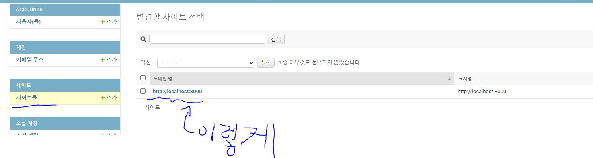

#  구글 소셜 로그인

[참고한 영상 유튜브](https://www.youtube.com/watch?v=2oTtswFyE0g)


일단 login앱을 만든다. 


project의 settings.py에서 설정을 바꾸어 준다. 

```python
# settings.py
INSTALLED_APPS = [
    ...
    "login.apps.LoginConfig",  
    # allauth
    "allauth",
    "allauth.account",
    "allauth.socialaccount",
    # provider 구글 페이스북 카톡 깃헙
    "allauth.socialaccount.providers.google",
]


......

AUTHENTICATION_BACKENDS = (
 	"django.contrib.auth.backends.ModelBackend", 
    "allauth.account.auth_backends.AuthenticationBackend",
)
SITE_ID = 1
LOGIN_REDIRECT_URL = "/accounts"  # 로그인 후 리다이렉트 될 경로

```

project의 urls.py에서

```python
urlpatterns = [
	...
    path("login/", include("allauth.urls")),
] 
```

login 앱에서

```python
from django.urls import path, include

urlpatterns = [
    path("login/", include("allauth.urls")),
]
```


html

```html
  <!-- 구글 로그인 -->
  
  
  <h1>인터넷응용 2020</h1>
  <a href="/accounts/signup">회원가입</a>
  
    <a href="/accounts/logout">로그아웃</a>
    {{user.username}}
    님이 로그인 중
  
    <a href="">구글 로그인</a><br>
    로그인 하세유
  
```


[key발급](https://cloud.google.com/apis?hl=ko)

API관리자 클릭

왼쪽의 사용자 인증 정보

https://www.youtube.com/watch?v=2oTtswFyE0g

17:30 참고

admin 에서 





